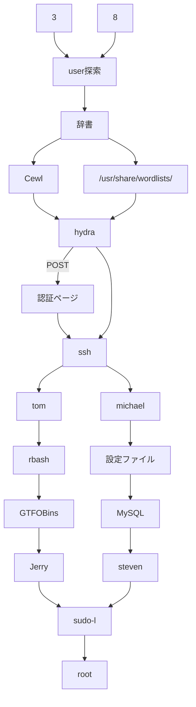

- 3のDC-2と8のRavenはwordpressが共通
- 3の方がCewlやhydra、rbashなどで難しい
  

```mermaid
graph TD;
  3-->user探索;
  8-->user探索;
  user探索-->辞書;
  辞書-->Cewl;
  辞書-->/usr/share/wordlists/ ;
  Cewl-->hydra
  /usr/share/wordlists/-->hydra
　hydra-->|POST|認証ページ
  認証ページ-->ssh
  hydra-->ssh
  ssh-->tom
  ssh-->michael
  tom-->rbash
  michael-->設定ファイル
  rbash-->GTFOBins
GTFOBins-->Jerry
  設定ファイル-->MySQL
MySQL-->steven
  Jerry-->sudo-l
  steven-->sudo-l
  sudo-l-->root
```
