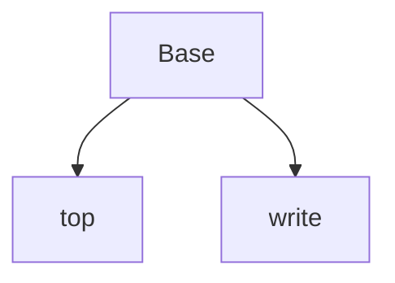

## HTMLに継承を使う
- top.htmlとwrite.htmlが被っているので共通の部分をbase.htmlとして別に抜き出す

- BaseがHTMLの枠組みを作っている。topやwriteは文字を変えたり、一部の形を変えている
### 注意する記号
- `{{ ~ }}`
  - 関数や変数を使える
- ``
  - 制御構造
  - 継承のブロック定義に使われる 

## ChatGPTなどでファイルを作る
- prompt.txt
```
### 指示
### 指示
- flaskを利用してwebアプリを作ろと思います
- 基本のテンプレートHTMLを作ってください

### 共通の仕様
- メニューやタイトルなどは日本語にしてください

### 作成したいHTMLテンプレート
- base.html: 継承元のテンプレート
- top.html: base.htmlを継承した、トップページのテンプレート
- write.html: base.htmlを継承した、書き込みページのテンプレート

### base.htmlの仕様
- ブロックとして、タイトルブロック、ヘッダーブロック、コンテンツブロックを持っている

### top.htmlの仕様
- write関数を呼び出すリンクを持っている


### write.htmlの仕様
- index関数を呼び出すリンクを持っている
```
- app.py
```py
from flask import Flask, render_template

app:Flask = Flask(__name__)

class Message:
    def __init__(self, id, user_name, contents):
        self.id=id
        self.user_name = user_name
        self.contents = contents

@app.route("/")
def index():
    login_user_name:str = "Hitoshi"
    message_list=[
        Message("0101", "hitoshi", "ハム"),
        Message("0102", "hitoshi", "ピザ"),
        Message("0103", "hitoshi", "ラーメン")
    ]
    return render_template("top.html", 
                login_user_name = login_user_name,
                message_list = message_list)

@app.route("/write")
def write():
    return render_template("write.html")

if __name__ == "__main__":
    app.run()
```

- base.html 
```html
<!DOCTYPE html>
<html>
<head>
    <title>タイトル</title>
</head>
<body>
    <header>
        <h1>ヘッダー</h1>
        <nav>
            <ul>
                <li><a href="{{url_for('index')}}">トップページ</a></li>
                <li><a href="{{url_for('write')}}">書き込みページ</a></li>
            </ul>
        </nav>
    </header>

    <main>
        
            まだ何もコンテンツがありません
        
    </main>
</body>
</html>
```

- top.html
```html


掲示板のトップページ


掲示板のトップページ - {{login_user_name}}

掲示板のトップページ - ゲストさん





<article>
    <p>{{message.id}} - {{ message.user_name}}</p>
    <p>{{message.contents}} </p>
</article>


```
- write.html
```html


掲示板の書き込みページ
掲示板の書き込みページ


    {{super()}}

```
